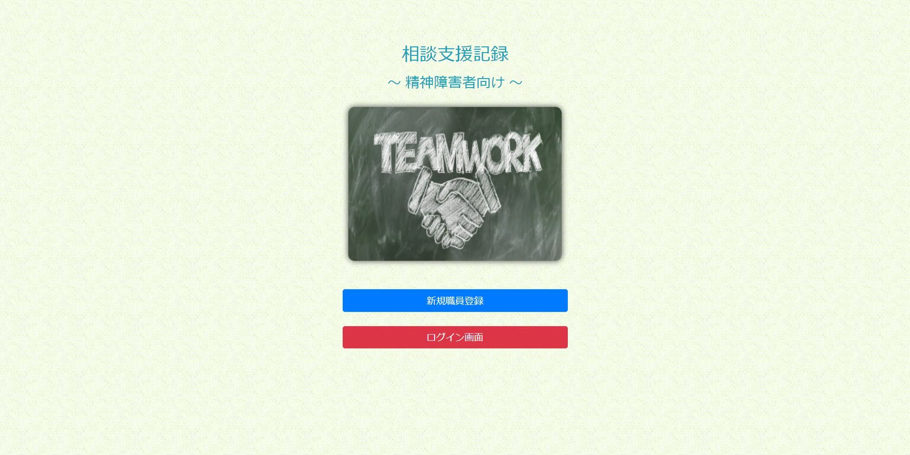

# case_work(精神障害者向けの相談記録アプリ)

## 技術要素

- 開発環境 AWS Cloud9/Amazon Linux AMI
- HTML5/CSS3
- bootstrap 4.3.1
- JavaScript/jQuery
- PHP 7.2.34
- mysql 5.5.62
- Laravel Framework 5.8.38
- PDO
- 画像の保存 AWS/S3
- バージョン管理 Git/Github
- テスト phpUnit/CircleCI
- デプロイ Heroku/EC2

## 機能一覧

- パスワード付き職員登録機能
- 職員一覧表示・職員プロフィール詳細表示機能
- 職員プロフィールの登録・編集機能
- 職員プロフィールに職員が登録した利用者・相談記録・業務日誌の一覧を表示させる機能
- 利用者一覧表示機能
- 利用者詳細表示機能
- 利用者詳細情報の登録・編集・削除機能
- 利用者検索機能
- 利用者のブックマーク追加・解除機能
- 各利用者の相談記録一覧表示機能
- 各相談記録の詳細表示機能
- 各相談記録の登録・編集・削除機能
- 相談記録の検索機能
- 相談記録のブックマーク追加・解除機能
- 各利用者の各相談記録に対するコメント投稿機能(公開範囲を全体公開、または自分のみに選択可能)
- 業務日誌一覧表示機能
- 業務日誌の詳細表示機能
- 業務日誌の登録・編集・削除機能
- 業務日誌のブックマーク追加・解除機能
- 業務日誌の検索機能
- ブックマークした利用者・相談記録・業務日誌の一覧を表示させる機能
- 各種フラッシュメッセージ表示機能
- 各種入力値に関するバリデーション機能
- 不正アクセス防止機能

## 実行画面の様子

;

## エピソード

レッスン用のサンプル教材として作成しました。

このサンプルをもとに、以下のような様々な拡張にチャレンジしてみるもの面白いかと思います。

- 会員登録・ログイン・ログアウト機能
- プロフィール編集機能
- いいね機能
- フォロー機能
- 会員間のでダイレクトメッセージ機能
- グループチャット機能

環境設定手順、SQLファイルはmemosフォルダ内にありますので、同じ環境を構築していただき、データをimportしてご利用ください。

また本番環境で動かすには、以下の設定ファイルを書き換えた上でデプロイしてください。

config/const.php

まだまだ不勉強なためバグが潜んでいるかもしれません。改善点などがありましたら、ご連絡いただけると幸いです。

## 著者
2022/05/30 Kazuma Iwai